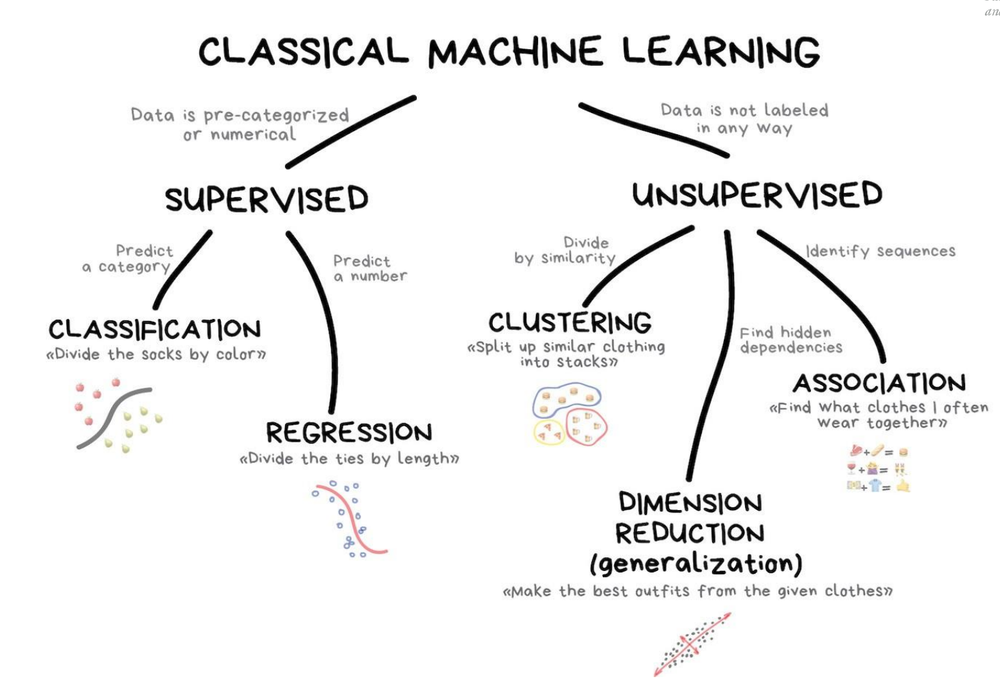
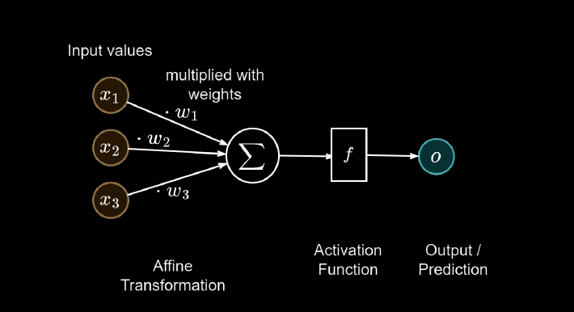
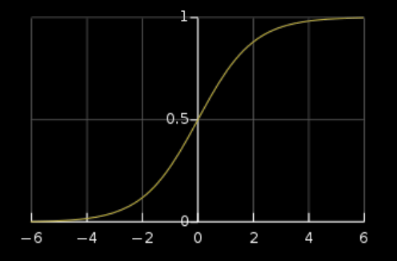
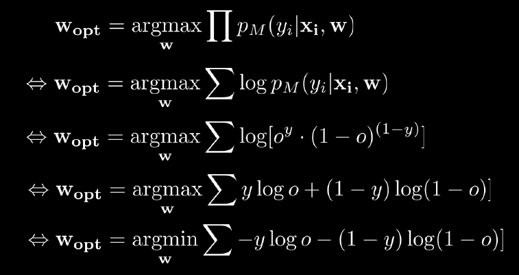

<style type="text/css">
  body{
    font-family: 'Times New Roman';
  }
</style>

# Introduction to AI Engineering Cheat Sheet

## **1. Mathematical basics:**

### **Convex and concave funcitons:**

#### Using line segments:
A function is convex if the line segment between any two points on the graph of the function lies above the graph itself. More formally, a function $ f: \mathbb{R}^n \rightarrow \mathbb{R} $ is convex if, for any two points $ \mathbf{x}_1 $ and $ \mathbf{x}_2 $ in its domain and for any $ \lambda $ in the interval $[0,1]$, the following inequality holds:

$$ f(\lambda \mathbf{x}_1 + (1-\lambda) \mathbf{x}_2) \leq \lambda f(\mathbf{x}_1) + (1-\lambda) f(\mathbf{x}_2) $$

On the other hand, a function is concave if the inequality above is reversed, meaning the line segment lies below the graph. Convexity and concavity are important concepts in optimization, economics, and various other fields.

#### Using derivatives:
1. **Convex Function:**
   - A function $ f(x) $ defined on an interval is convex if its first derivative is non-decreasing or non-increasing over that interval.
   - Mathematically, if $ f''(x) \geq 0 $ for all $ x $ in the interval, then $ f(x) $ is convex.

2. **Concave Function:**
   - A function $ f(x) $ defined on an interval is concave if its first derivative is non-increasing or non-decreasing over that interval.
   - Mathematically, if $ f''(x) \leq 0 $ for all $ x $ in the interval, then $ f(x) $ is concave.

## **2. Search:**

### a) Agents:

An agent is an entity that perceives its environment through sensors and acts upon that environment through actuators. In the context of search algorithms, an agent is typically an algorithm designed to explore a problem space to find a solution.

### b) Optimal vs. Complete Planning:

- **Optimal Planning:** Finding the best solution among all possible solutions.
- **Complete Planning:** Ensuring that the algorithm will find a solution if one exists.

### c) State Space:

A state space is the set of all possible states that a problem can be in. In the context of search algorithms, it represents the configurations or situations the algorithm explores to find a solution.

### d) Uninformed vs. Informed Search:

- **Uninformed Search:** Algorithms that explore the search space without using any domain-specific knowledge.
- **Informed Search:** Algorithms that use domain-specific knowledge (heuristics) to guide the search.

### e) DFS and BFS:

- **Depth-First Search (DFS):**
  - **Pros:** Memory-efficient, suitable for large state spaces.
  - **Cons:** Not guaranteed to find the shortest path.

- **Breadth-First Search (BFS):**
  - **Pros:** Guaranteed to find the shortest path.
  - **Cons:** Memory-intensive, may not be practical for large state spaces.

### f) Search Using Heuristics:

Search using heuristics involves incorporating domain-specific knowledge to guide the search. A heuristic is a rule of thumb that estimates the cost of reaching the goal.

### g) Greedy, Beam, and A*:

- **Greedy Search:**
  - **Explanation:** Chooses the path that looks most promising based on heuristic information.
  - **Pros:** Simple and fast.
  - **Cons:** Not guaranteed to find the optimal solution.

- **Beam Search:**
  - **Explanation:** Maintains a set of the best k partial solutions.
  - **Pros:** Balances optimality and exploration.
  - **Cons:** May miss the optimal solution.

- **A* Search:**
  - **Explanation:** Uses both the cost to reach a state and the heuristic estimate to guide the search.
  - **Pros:** Guarantees optimality if the heuristic is admissible.
  - **Cons:** Requires careful selection of the heuristic.
  - $f(n) = g(n) + h(n)$, where $g(n)$ is the cost to reach node $n$, and $h(n)$ is the heuristic estimate.


### h) N-Queens and K/N-Knights Problem:

- **N-Queens Problem:** Placing N chess queens on an N×N chessboard so that no two queens threaten each other.
  
- **K/N-Knights Problem:** Placing K knights on an N×N chessboard so that no two knights threaten each other.

### i) Hill Climbing:

Hill climbing is a local search algorithm that starts with an arbitrary solution and iteratively moves towards a better solution in its neighborhood, based on an evaluation function.

### j) Simulated Annealing:

>Simulated annealing is a probabilistic optimization algorithm inspired by the annealing process in metallurgy. It escapes local optima by occasionally accepting worse solutions with a decreasing probability.

Simulated Annealing is a probabilistic optimization algorithm inspired by the annealing process in metallurgy. It is commonly used to find approximate solutions to optimization problems. The algorithm allows for exploring the solution space and escaping local optima by accepting worse solutions with a decreasing probability.

Here's a simplified overview of how Simulated Annealing is typically implemented:

1. **Initialize:**
   - Start with an initial solution $S$.
   - Set the initial temperature $T$, and choose cooling schedule parameters (e.g., cooling rate).

2. **Iterate:**
   - Repeat until stopping criterion is met (e.g., a maximum number of iterations, a target temperature, or a satisfactory solution is found).
     - Perturb the current solution to generate a neighboring solution $S'$.
     - Calculate the change in objective function value: $\Delta E = E(S') - E(S)$.
     - If $\Delta E < 0$, accept the new solution ($S = S'$).
     - If $\Delta E \geq 0$, accept the new solution with probability $P = e^{-\frac{\Delta E}{T}}$.
     - Reduce the temperature according to the cooling schedule (e.g., $T = \alpha \cdot T$, where $0 < \alpha < 1$).

3. **Output:**
   - Return the best solution found.

### Pseudocode:

```python
import math
import random

def euclidean_distance(city1, city2):
    # Calculate Euclidean distance between two cities
    x1, y1 = city1
    x2, y2 = city2
    return math.sqrt((x2 - x1)**2 + (y2 - y1)**2)

def total_distance(route, cities):
    # Calculate the total distance of a route
    distance = 0
    for i in range(len(route) - 1):
        distance += euclidean_distance(cities[route[i]], cities[route[i + 1]])
    distance += euclidean_distance(cities[route[-1]], cities[route[0]])  # Return to the starting city
    return distance

def generate_initial_solution(num_cities):
    # Generate a random initial solution (route) visiting all cities
    return random.sample(range(num_cities), num_cities)

def perturb_solution(route):
    # Perturb the current solution by swapping two randomly selected cities
    new_route = route.copy()
    i, j = random.sample(range(len(route)), 2)
    new_route[i], new_route[j] = new_route[j], new_route[i]
    return new_route

def simulated_annealing(cities, initial_temperature, cooling_rate, max_iterations):
    current_route = generate_initial_solution(len(cities))
    best_route = current_route
    temperature = initial_temperature

    for iteration in range(max_iterations):
        new_route = perturb_solution(current_route)
        delta_distance = total_distance(new_route, cities) - total_distance(current_route, cities)

        if delta_distance < 0 or random.random() < math.exp(-delta_distance / temperature):
            current_route = new_route

        if total_distance(current_route, cities) < total_distance(best_route, cities):
            best_route = current_route

        temperature *= cooling_rate

    return best_route

# Example usage:
cities_coordinates = [(0, 0), (1, 2), (3, 1), (5, 2), (2, 3)]
initial_temp = 1000
cooling_rate = 0.99
max_iterations = 1000

best_route = simulated_annealing(cities_coordinates, initial_temp, cooling_rate, max_iterations)
print("Best Route:", best_route)
print("Total Distance:", total_distance(best_route, cities_coordinates))

```

### Parameters:
- **Initial Solution:** The starting point in the solution space.
- **Initial Temperature:** Controls the probability of accepting worse solutions initially.
- **Cooling Rate ($\alpha$):** Determines how fast the temperature decreases.
- **Threshold Temperature:** The algorithm stops when the temperature reaches this threshold.

### Important Considerations:
- The acceptance probability decreases with time (temperature).
- Simulated Annealing can be sensitive to parameter values, and tuning may be required.
- The cooling schedule affects the balance between exploration and exploitation.

Implementations may vary based on the specific problem being solved and the details of the optimization landscape. Adjustments to parameters and strategies for generating neighboring solutions may be necessary for different applications.


### k) Genetic Algorithms:

Genetic algorithms are optimization algorithms inspired by the process of natural selection. They use techniques such as crossover and mutation to evolve a population of potential solutions towards an optimal solution.

## **3. Logic:**

1. **Law of Identity:**
   - $P \equiv P$

2. **Law of Non-Contradiction:**
   - $\neg(P \land \neg P)$

3. **Law of Excluded Middle:**
   - $P \lor \neg P$

4. **Double Negation:**
   - $\neg\neg P \equiv P$

5. **Commutative Laws:**
   - $P \land Q \equiv Q \land P$
   - $P \lor Q \equiv Q \lor P$

6. **Associative Laws:**
   - $(P \land Q) \land R \equiv P \land (Q \land R)$
   - $(P \lor Q) \lor R \equiv P \lor (Q \lor R)$

7. **Distributive Laws:**
   - $P \land (Q \lor R) \equiv (P \land Q) \lor (P \land R)$
   - $P \lor (Q \land R) \equiv (P \lor Q) \land (P \lor R)$

8. **Identity Laws:**
   - $P \land \text{True} \equiv P$
   - $P \lor \text{False} \equiv P$

9. **Domination Laws:**
   - $P \land \text{False} \equiv \text{False}$
   - $P \lor \text{True} \equiv \text{True}$

10. **Negation Laws:**
    - $P \land \neg P \equiv \text{False}$
    - $P \lor \neg P \equiv \text{True}$

11. **Implication Rules:**
    - $P \rightarrow Q \equiv \neg P \lor Q$

12. **Bi-Implication Rule:**
    - $P \leftrightarrow Q \equiv (P \rightarrow Q) \land (Q \rightarrow P)$

13. **De Morgan's Laws:**
    - $\neg(P \land Q) \equiv \neg P \lor \neg Q$
    - $\neg(P \lor Q) \equiv \neg P \land \neg Q$

14. **Contrapositive Rule:**
    - $P \rightarrow Q \equiv \neg Q \rightarrow \neg P$

15. **Quantifier Rules (for all):**
    - $\forall x (P(x) \land Q(x)) \equiv \forall x P(x) \land \forall x Q(x)$
    - $\forall x (P(x) \lor Q(x)) \equiv \forall x P(x) \lor \forall x Q(x)$

16. **Quantifier Rules (exists):**
    - $\exists x (P(x) \land Q(x)) \equiv \exists x P(x) \land \exists x Q(x)$
    - $\exists x (P(x) \lor Q(x)) \equiv \exists x P(x) \lor \exists x Q(x)$

### **Conjunctive Normal Form (CNF):**

The general form of a formula in CNF is:

$$ (L_{1,1} \lor L_{1,2} \lor \ldots \lor L_{1,k_1}) \land (L_{2,1} \lor L_{2,2} \lor \ldots \lor L_{2,k_2}) \land \ldots \land (L_{m,1} \lor L_{m,2} \lor \ldots \lor L_{m,k_m}) $$

where $L_{i,j}$ represents a literal (either a variable or its negation) in the $i$-th clause.

### Benefits of CNF:

1. **Satisfiability Checking:** CNF is particularly useful for checking the satisfiability of logical formulas. Many automated reasoning tools and SAT solvers work with formulas in CNF.

2. **Simplification:** Some logical operations and simplifications are more easily applied to formulas in CNF.

3. **Standard Representation:** CNF provides a standard and convenient representation that facilitates comparisons and analyses of logical formulas.

### **Resolution:**

Proof by resolution is a method used in propositional logic and automated theorem proving to establish the validity of a logical formula. It relies on the resolution rule, which states that if you have two clauses that contain complementary literals (one positive and the other negative), you can resolve them by eliminating the complementary literals. The result is a new clause formed by combining the non-complementary literals from both clauses.
! You can only cancel one at a time !

Suppose we have the following two clauses:

$$ C_1: (\neg P \lor Q) $$
$$ C_2: (\neg Q \lor R) $$

To apply the resolution rule, we look for complementary literals (one positive, one negative) in the two clauses. In this case, $\neg Q$ in $C_1$ and $Q$ in $C_2$ are complementary. Applying resolution, we eliminate these complementary literals:

$$ \frac{(\neg P \lor Q), \quad (\neg Q \lor R)}{\neg P \lor R} $$

The result is a new clause, $\neg P \lor R$. This is the simplified form obtained by resolving the original clauses.

In words, this resolution step tells us that if $(\neg P \lor Q)$ is true and $(\neg Q \lor R)$ is true, then $(\neg P \lor R)$ must also be true.

It's important to note that resolution is often applied iteratively and can involve more clauses in more complex examples. This simple example illustrates the basic idea of resolving complementary literals to simplify logical statements.

### **Proof by Resolution:**

-  How? Start with Conjunctive Normal Form
- Take two clauses that contain the same literal,
exactly one of them negated
- From those two clauses, we can infer a new clause
that also holds by removing this literal
- If we can infer the empty clause, we have found a contradiction!

### **Entailment:**

Entailment is a relationship between two logical statements, typically denoted as $A \models B$, which reads "A entails B." This means that if statement A is true, then statement B must also be true. In formal logic, entailment is often expressed using logical symbols and formulas.

The formal expression for entailment involves an implication, and it can be written as:

$$ A \models B \equiv (A \rightarrow B) $$

In words, $A \models B$ is equivalent to saying that "if A is true, then B must be true."

### **Forward Chaining:**

Forward chaining is a reasoning method where you start with known facts and repeatedly apply rules to generate
new facts until a specific goal or condition is met. It's commonly used in rule-based systems and expert systems for
automated decision-making and inference.

### **First-order logic (FOL) and propositional logic (PL):**
are two distinct branches of classical logic that serve different purposes and have different expressive powers. Here are some key differences between first-order logic and propositional logic:

### 1. **Expressive Power:**
   - **Propositional Logic (PL):** Deals with propositions (statements) that are either true or false. It lacks the ability to express relationships between objects and quantification over variables.
   - **First-Order Logic (FOL):** Allows for the representation of relationships between objects, quantification over variables, and the use of predicates to express more complex statements.

### 2. **Syntax:**
   - **PL:** Involves simple propositions (atomic statements) and logical connectives (AND, OR, NOT).
   - **FOL:** Introduces variables, quantifiers (exists, forall), functions, and predicates. Statements involve quantified variables and are structured using more complex syntax.

### 3. **Quantification:**
   - **PL:** No concept of variables or quantifiers.
   - **FOL:** Supports quantifiers like ∀ (for all) and ∃ (exists), allowing statements to express generalities or existence of objects.

### 4. **Applications:**
   - **PL:** Often used in situations where propositions are sufficient to represent the problem, such as in mathematical logic or certain types of automated reasoning.
   - **FOL:** Used in a broader range of applications, including knowledge representation, database query languages, natural language processing, and reasoning about complex systems.

### 5. **Granularity:**
   - **PL:** Deals with entire propositions as atomic units.
   - **FOL:** Provides a more granular approach, allowing for the decomposition of statements into individual objects, relations, and properties.

### 6. **Soundness and Completeness:**
   - **PL:** Propositional logic is both sound and complete.
   - **FOL:** First-order logic is also sound and complete, but it is more complex due to its richer language.

### 7. **Example:**
   - **PL:** $P \land Q \rightarrow R$
   - **FOL:** $\forall x \forall y (Parent(x, y) \rightarrow Ancestor(x, y))$

In summary, propositional logic is limited to dealing with truth values of entire propositions, while first-order logic allows for a more expressive representation of relationships between objects and quantification over variables, making it more suitable for a wider range of applications involving complex reasoning and knowledge representation.

### **FOL: Modus Ponens:**
Modus ponens is a basic
deductive inference rule that works
like this: If you have a conditional
statement (If P, then Q) and you
know that the antecedent (P) is
true, then you can validly conclude
that the consequent (Q) is also
true. In short, if you have "If P,
then Q" and you know P is true,
then you can assert Q is true.

### **Higher Order Locig (HOL):**

Higher-order logic (HOL) is an extension of first-order logic (FOL) that allows for quantification not only over individuals (objects) but also over functions and predicates. In other words, while first-order logic allows quantification over variables representing objects, higher-order logic allows quantification over variables representing functions and relations.

Key features of higher-order logic include:

1. **Higher-Order Quantifiers:**
   - In first-order logic, quantifiers ($\forall, \exists$) operate only on individual variables.
   - In higher-order logic, quantifiers can range over functions, relations, or predicates. For example, $\forall P$ might denote "for all predicates $P$."

2. **Function Variables:**
   - Higher-order logic allows variables to represent not only objects but also functions. This enables statements about functions and their properties.

3. **Predicate Variables:**
   - Similar to functions, higher-order logic allows variables to represent predicates or relations. This allows statements about properties of relations and their compositions.

4. **Expressive Power:**
   - Higher-order logic is more expressive than first-order logic due to its ability to represent and reason about higher-order entities like functions and predicates. It can capture more complex relationships and properties.

#### Example:

In first-order logic:

$$ \forall x \exists y \, R(x, y) $$

This statement asserts that for every individual $x$, there exists an individual $y$ such that $R(x, y)$ holds.

In higher-order logic:

$$ \forall P \, \exists Q \, \forall x \, P(x) \rightarrow Q(x) $$

This statement asserts that for every predicate $P$, there exists a predicate $Q$ such that for all individuals $x$, if $P(x)$ holds, then $Q(x)$ also holds.

#### Use Cases:

Higher-order logic finds applications in various fields, including:

- **Formal Methods:** Used in formal verification of software and hardware systems.
- **Mathematics:** Provides a foundation for set theory and mathematical reasoning.
- **Automated Reasoning:** Enables more expressive representation of knowledge and reasoning about complex systems.

While higher-order logic is more expressive, it also introduces additional complexities, and reasoning in higher-order logic can be more challenging computationally compared to first-order logic.

## **3.5 Knowledge graphs:**

### **Onthologies:**

- Upper Ontology:
  Describes a general conceptualization of the world
- Domain Ontology :
  Describes concepts in a very specific domain
- There is a continuum between the two (Mid-level ontologies)

You
have some conceptualization - some abstraction from the real world - that takes form of important
concepts and relationships.
You find ontologys in medicine very often.
- tree of species
- genetics
- illnesses
It should be unambigious and in a way, that you can process it with machines.

### **Knowledge graphs:**

- Network structure with nodes and edges
- Directed, edge-labeled graphs
- Nodes represents entities in the real world
- Edges represent relations between these entities
- Nodes and edges have well-defined meanings


### **Open World Assumption/Closed World Assumption:**

- Closed World Assumption (CWA): absence of a fact means it is
necessarily false.
Knowledge graph can be considered ground truth
- Open World Assumption (OWA): absence of a fact does not imply
fact is false. We simply do not know.

### **RDF:**

- Resource Description Framework (RDF)
- is written in XML

### **XML Schema:**

XML Schema, often referred to as XSD (XML Schema Definition), is a specification used to describe the structure and constraints of XML documents. In technical terms:
1. **Structure Definition:** XML Schema defines the elements and attributes that can appear in an XML document, specifying their order, nesting, and relationships. It essentially serves as a blueprint
for the structure of XML data.
2. **Data Types:** XML Schema provides a way to specify the data types of elements and attributes, ensuring that the content of an XML document adheres to a predefined set of rules. This helps in
validating the data against specific criteria.
3. **Constraints and Validation:** XML Schema allows you to set constraints on the data, such as minimum and maximum occurrences of elements, valid values for attributes, and patterns for
character data. This enables the validation of XML documents to ensure they conform to the defined rules.
4. **Namespace Support:** XML Schema supports XML namespaces, allowing for the definition of elements and attributes within specific namespaces. This is crucial for avoiding naming conflicts in
XML documents.
In summary, XML Schema is a way to define the structure, data types, and constraints of XML documents, providing a mechanism for validation to ensure that XML data adheres to a 65
 predefined set of
rules. It plays a vital role in promoting interoperability and data consistency in systems that exchange XML-based information.

### **OWL:**

OWL (Web Ontology Language) is a semantic web language designed to represent and reason about knowledge in a machine-readable way. It is part of the W3C's (World Wide Web Consortium) family of web standards for the Semantic Web. The primary goal of OWL is to enable machines to understand and process information on the web by providing a rich vocabulary for expressing relationships and constraints between entities.

Key features of OWL include:

Ontologies:

- OWL allows the creation of ontologies, which are formal and explicit specifications of conceptualizations. Ontologies define classes, properties, individuals, and the relationships between them.
Rich Vocabulary:

- OWL provides a rich vocabulary for representing various constructs, including classes, individuals, properties, restrictions, and axioms. It enables the modeling of complex relationships and constraints.
Expressivity:

- OWL comes in different versions (OWL Lite, OWL DL, and OWL Full) with varying levels of expressivity. OWL DL (Description Logic) is particularly powerful and strikes a balance between expressivity and computational complexity.
Inference:

- OWL supports automated reasoning and inference. Reasoning engines can be used to infer implicit knowledge from explicitly stated facts and rules in an ontology.
Interoperability:

- OWL promotes interoperability by providing a standardized way to represent and share ontologies on the web. It allows different systems and applications to understand and exchange information.
Semantic Web:

- OWL is a key component of the Semantic Web vision, where information is not only presented in a machine-readable format but is also semantically meaningful, enabling more intelligent processing by machines.

**SPARQL:**

- SPARQL Protocol and RDF Query Language
- Semantic Query language for databases
- Particularly for RDF-based Knowledge Graphs
- Allows for querying:
  - Triple Patterns
  - Conjunction, Disjunctions
  - Optional Patterns
- There are implementations in multiple programming languages

## **4. Bayesian Networks:**

Bayesian networks, also known as belief networks or Bayes nets, are graphical models that represent the probabilistic relationships among a set of variables. These networks are particularly useful for reasoning under uncertainty and making predictions or inferences.

The basic components of a Bayesian network are nodes, which represent random variables, and directed edges, which represent probabilistic dependencies between the variables. The network structure encodes the conditional independence relationships among the variables.

---

**What you should know: (from the slides)**

- Definitions of probability, random variables, ...
- Basic distributions: Normal distribution, Binomial distribution, ...
- Joint probabilities $P(X=x, Y=y)$, Conditional Probabilities $P(X=x| Y=y)$
  - add events to a probability. look at x in all combinations with y.
- Marginalization: $P(X=x) = \sum_y P(X=x, Y=y)$
- Chain Rule: $P(x_1, x_2, x_3) = P(x_3 | x_1, x_2) P(x_1, x_2) = P(x_3 | x_1, x_2) P(x_2 | x_1) P(x_1)$
- $P(x_1, x_2 ,..., x_n) = \prod_i P(x_i | x_1,..., x_{i-1})$

---

Here's a detailed notation example:

Let's consider a simple example of a Bayesian network that represents the relationships between two variables: Rain (R) and Traffic Jam (T). We want to model how the occurrence of rain influences the likelihood of a traffic jam.

1. **Nodes:**
   - $ R $: Rain (a binary variable, where 0 represents no rain and 1 represents rain)
   - $ T $: Traffic Jam (a binary variable, where 0 represents no traffic jam and 1 represents a traffic jam)

2. **Edges:**
   - An arrow from $ R $ to $ T $ indicates that $ R $ influences $ T $, meaning that the occurrence of rain influences the likelihood of a traffic jam.

3. **Conditional Probability Tables (CPTs):**
   - Each node has a conditional probability table associated with it, which specifies the probability distribution of that variable given the values of its parents in the network.

   $$
   P(R) = 
   \begin{bmatrix}
   P(R=0) \\
   P(R=1)
   \end{bmatrix}
   $$

   - This table indicates the probabilities of no rain ($ R=0 $) and rain ($ R=1 $).

   $$
   P(T | R) = 
   \begin{bmatrix}
   P(T=0 | R=0) & P(T=1 | R=0) \\
   P(T=0 | R=1) & P(T=1 | R=1)
   \end{bmatrix}
   $$

   - This table specifies the conditional probabilities of traffic jam ($ T $) given the values of rain ($ R $).

For example, the CPT for $ P(T | R) $ might look like this:

$$
\begin{array}{|c|c|c|}
\hline
R & P(T=0 | R) & P(T=1 | R) \\
\hline
0 & 0.9 & 0.1 \\
1 & 0.4 & 0.6 \\
\hline
\end{array}
$$

This table indicates, for instance, that the probability of no traffic jam ($ T=0 $) is 0.9 when there is no rain ($ R=0 $), and the probability of a traffic jam ($ T=1 $) is 0.6 when there is rain ($ R=1 $).

In summary, Bayesian networks provide a compact and intuitive way to represent complex probabilistic relationships, and the notation helps specify the probability distributions of variables given the values of their parents in the network.

### **Example:**

Let's consider a more complex example involving three variables: Burglary (B), Earthquake (E), and Alarm (A). We want to model how the occurrence of a burglary or an earthquake influences the activation of an alarm system.

1. **Nodes:**
   - $ B $: Burglary (binary variable: 0 for no burglary, 1 for burglary)
   - $ E $: Earthquake (binary variable: 0 for no earthquake, 1 for earthquake)
   - $ A $: Alarm (binary variable: 0 for no alarm, 1 for alarm)

2. **Edges:**
   - $ B $ and $ E $ are independent in this example, meaning there is no direct influence between them.
   - $ B $ and $ E $ both influence $ A $, meaning that the occurrence of burglary or earthquake can trigger the alarm.

3. **Conditional Probability Tables (CPTs):**
   - $ P(B) $:
   $$
   P(B) = 
   \begin{bmatrix}
   P(B=0) \\
   P(B=1)
   \end{bmatrix}
   $$

   - $ P(E) $:
   $$
   P(E) = 
   \begin{bmatrix}
   P(E=0) \\
   P(E=1)
   \end{bmatrix}
   $$

   - $ P(A | B, E) $:
   $$
   P(A | B, E) = 
   \begin{bmatrix}
   P(A=0 | B=0, E=0) & P(A=1 | B=0, E=0) \\
   P(A=0 | B=0, E=1) & P(A=1 | B=0, E=1) \\
   P(A=0 | B=1, E=0) & P(A=1 | B=1, E=0) \\
   P(A=0 | B=1, E=1) & P(A=1 | B=1, E=1)
   \end{bmatrix}
   $$

For example, the CPT for $ P(A | B, E) $ might look like this:

$$
\begin{array}{|c|c|c|c|}
\hline
B & E & P(A=0 | B, E) & P(A=1 | B, E) \\
\hline
0 & 0 & 0.999 & 0.001 \\
0 & 1 & 0.99 & 0.01 \\
1 & 0 & 0.9 & 0.1 \\
1 & 1 & 0.01 & 0.99 \\
\hline
\end{array}
$$

This table indicates, for instance, that the probability of no alarm ($ A=0 $) is 0.999 when there is no burglary and no earthquake ($ B=0, E=0 $), and the probability of an alarm ($ A=1 $) is 0.01 when there is burglary and earthquake ($ B=1, E=1 $).

In summary, this Bayesian network illustrates how the variables are connected and how the probability of one variable depends on the values of its parents in the network. The CPTs provide a way to specify these conditional probabilities for each combination of parent values.

### **An exmaple for variable elimination:**

Variable elimination is a method used to compute probabilities and make inferences in Bayesian networks more efficiently by eliminating unnecessary variables. The idea is to reduce the computational complexity by focusing on the variables that are relevant to the query and eliminating others.

Let's consider the example Bayesian network with variables $B$ (Burglary), $E$ (Earthquake), and $A$ (Alarm) again. Suppose we want to compute the probability $P(A=1)$, the probability of the alarm being activated, given the evidence that there is no burglary ($B=0$) and no earthquake ($E=0$).

1. **Original Bayesian Network:**

   ```
   B       E
    \     /
     \   /
      \ /
       A
   ```

2. **Query: $P(A=1 | B=0, E=0)$**

   To compute this probability, we can use the variable elimination algorithm. The basic steps are as follows:

   a. **Initialization:**
      - Begin by initializing factors for each conditional probability table (CPT).

   b. **Variable Elimination:**
      - Eliminate variables not involved in the query or evidence. In this case, eliminate $B$ and $E$ since they are evidence.
      
      - Multiply the relevant factors: $P(A | B, E)$ and $P(B)$.
      
      - Sum out the eliminated variables ($B$ and $E$) by marginalizing them.
   
   c. **Result:**
      - The result is a factor representing $P(A=1 | B=0, E=0)$.

Let's go through the steps with the given CPTs:

   - $P(A | B, E)$:
   $$
   \begin{array}{|c|c|c|c|}
   \hline
   B & E & P(A=0 | B, E) & P(A=1 | B, E) \\
   \hline
   0 & 0 & 0.999 & 0.001 \\
   0 & 1 & 0.99 & 0.01 \\
   1 & 0 & 0.9 & 0.1 \\
   1 & 1 & 0.01 & 0.99 \\
   \hline
   \end{array}
   $$

   - $P(B)$:
   $$
   \begin{array}{|c|c|}
   \hline
   B & P(B) \\
   \hline
   0 & 1 \\
   1 & 0 \\
   \hline
   \end{array}
   $$

   Multiply the relevant factors and sum out $B$ and $E$:

   $$
   \begin{align*}
   & \sum_{B, E} P(A, B, E) \\
   & = \sum_{B, E} P(A | B, E) \cdot P(B) \\
   & = P(A=0 | B=0, E=0) \cdot P(B=0) + P(A=1 | B=0, E=0) \cdot P(B=0) \\
   & = (0.999 \cdot 1) + (0.001 \cdot 1) \\
   & = 1
   \end{align*}
   $$

   Now, normalize to obtain $P(A=1 | B=0, E=0)$:

   $$
   P(A=1 | B=0, E=0) = \frac{0.001}{1} = 0.001
   $$

So, the probability of the alarm being activated ($A=1$) given no burglary ($B=0$) and no earthquake ($E=0$) is 0.001. Variable elimination helped simplify the computation by focusing on the relevant variables.

---
### **Sampling in Bayesian Networks:**

Sampling in Bayesian networks is a technique used to estimate probabilities and make inferences by generating random samples from the joint probability distribution of the variables in the network. This approach is particularly useful when the exact computation of probabilities is computationally expensive or intractable. Markov Chain Monte Carlo (MCMC) methods, such as Gibbs sampling and Metropolis-Hastings, are commonly used for this purpose.

Here's a simple example using the Bayesian network from the previous examples with variables $B$ (Burglary), $E$ (Earthquake), and $A$ (Alarm):

```plaintext
B       E
 \     /
  \   /
   \ /
    A
```

Let's say we want to estimate the probability $P(A=1 | B=0, E=1)$, meaning the probability of the alarm being activated given no burglary and an earthquake.

**Sampling Algorithm:**

1. **Initialize:** Set the values of the evidence variables ($B=0, E=1$).

2. **Iterate:**
   - For each iteration, sample values for the non-evidence variables ($A$ in this case) based on their conditional probabilities given the values of their parents.
   - Record the samples.

3. **Estimate Probability:**
   - Count the number of samples where $A=1$ given $B=0$ and $E=1$.
   - Estimate the probability as the ratio of the count of favorable samples to the total number of samples.

**Example:**

Let's assume we generate 1000 samples using Gibbs sampling:

1. **Initialization:** $B=0, E=1$

2. **Iterate:**
   - Sample $A$ given $B=0, E=1$ based on $P(A | B, E)$.

   Repeat this process for a sufficient number of iterations.

3. **Estimate Probability:**
   - Count the number of samples where $A=1$ given $B=0, E=1$.

For instance, if after 1000 iterations, we find that $A=1$ in 20 samples, then we can estimate $P(A=1 | B=0, E=1)$ as $20/1000 = 0.02$.

Sampling provides an approximate solution to Bayesian network inference problems, especially when exact computation is challenging due to a large number of variables or complex dependencies. It allows us to obtain a Monte Carlo estimate of the desired probability by simulating from the joint distribution of the variables.

### **Likelihood Weighting:**

Likelihood weighting is a method for approximating probabilities in Bayesian networks by generating weighted samples. It is a type of importance sampling technique that focuses on generating samples that are consistent with the evidence (observed values) in order to estimate probabilities.

In the context of Bayesian networks, the likelihood weighting algorithm works as follows:

1. **Initialization:**
   - Set the evidence variables to their observed values.
   - Initialize the weight of the sample to 1.

2. **Sampling:**
   - For each non-evidence variable, sample its value based on the conditional probability distribution given the values of its parents in the network.
   - Multiply the weight of the sample by the likelihood of the evidence variables given the sampled values.

3. **Repeat:**
   - Repeat the sampling process for a specified number of iterations.

4. **Estimate Probability:**
   - Estimate the probability of the query variable (or a set of variables) given the evidence by normalizing the sum of the weights of the consistent samples.

Let's use the same Bayesian network example with variables $B$ (Burglary), $E$ (Earthquake), and $A$ (Alarm). Suppose we want to estimate the probability $P(A=1 | B=0, E=1)$ using likelihood weighting.

1. **Initialization:** Set $B=0, E=1$, and initialize weight to 1.

2. **Sampling:**
   - Sample $A$ given $B=0, E=1$ based on $P(A | B, E)$.
   - Multiply the weight by $P(B=0) \cdot P(E=1) \cdot P(A=1 | B=0, E=1)$.

3. **Repeat:**
   - Repeat the sampling process for a specified number of iterations.

4. **Estimate Probability:**
   - Estimate $P(A=1 | B=0, E=1)$ by normalizing the sum of the weights of consistent samples.

The key idea of likelihood weighting is that it assigns higher weights to samples that are consistent with the evidence, making the estimation more accurate for the observed variables. This method is particularly useful when the query involves a specific set of evidence variables, and it can provide a computationally efficient approximation in situations where exact inference is challenging.

## **5. Machine Learning**


---
- Supervised machine learning
  - There is one (or more) specific things to predict
  - Learn model parameters from feature-label pairs
  - Training examples are given that include information on that thing
- Unsupervised machine learning
  - No prediction of a specific thing
  - Learn useful properties about the structure of the features
  - Learn model parameters using dataset without labels
---
- Self-Supervised Machine Learning:
  - Learn model parameters using dataset of data-data pairs
  - Example: build a model to complete a sentence
- Reinforcement Learning
  - Learn model parameters using exploration and sparse rewards
  - Example: Board game: Learn result from the end
- Deep Learning
  - A specific part of Machine Learning that uses a particular class of models
  - More later in the class
---

**Terminology:**

- rows:
  - a row is a data instance
  - describes all the known properties of one entity
  - Rows should be independent from each other

- columns:
  - is called a feature (sometimes attribute, or property)
  - Gives information on one property for all instances 
  - Can be dependent from each other

- inputs
  - can be anything

- outputs:
  - Classification: Output is prediction of a class (class or probability)
  - Multiclass-Classification: Choose between more than 2 classes
  - Prediction/Regression: Output is a number
  - Structured Prediction: Output is „more complex“
---

**Learning:**
- Estimate parameters w from training data $\{(x , y )\}$
- Hyperparameters are parameters that are set by the user that
determine the learning procedure (not learned)
- Come up with a loss function

---

### **Regression:**

Regression is a statistical method used in machine learning and data analysis to model the relationship between a dependent variable (also called the response variable) and one or more independent variables (also called predictors or features). The goal of regression analysis is to understand and quantify the relationship between variables, as well as to make predictions based on that relationship.

There are two main types of regression:

1. **Linear Regression:**
   - Linear regression models the relationship between the dependent variable $y$ and one or more independent variables $x$ by fitting a linear equation to the observed data. The general form of a simple linear regression model is:

   $$ y = \beta_0 + \beta_1 \cdot x + \epsilon $$

   - Here, $y$ is the dependent variable, $x$ is the independent variable, $\beta_0$ is the intercept, $\beta_1$ is the slope, and $\epsilon$ is the error term.

   - In multiple linear regression, when there are multiple independent variables, the equation becomes:

   $$ y = \beta_0 + \beta_1 \cdot x_1 + \beta_2 \cdot x_2 + \ldots + \beta_n \cdot x_n + \epsilon $$

2. **Non-linear Regression:**
   - Non-linear regression models the relationship between variables using non-linear equations. These equations can take various forms, such as exponential, logarithmic, polynomial, or other non-linear functions.

   $$ y = \beta_0 + \beta_1 \cdot e^{\beta_2 \cdot x} + \epsilon $$

   - The specific form of the non-linear equation depends on the nature of the relationship between the variables.

**Key Concepts:**

- **Parameters ($\beta$):** In regression, the parameters represent the coefficients that the model learns during the training process. These coefficients quantify the strength and direction of the relationship between the variables.

- **Training:** The process of fitting the regression model to the training data involves finding the values of the parameters that minimize the difference between the predicted values and the actual values (minimizing the error or residuals).

- **Prediction:** Once the model is trained, it can be used to predict the values of the dependent variable for new, unseen data.

- **Evaluation:** The performance of a regression model is often evaluated using metrics such as mean squared error (MSE), mean absolute error (MAE), or $R^2$ (coefficient of determination).

Regression analysis is widely used in various fields, including economics, finance, biology, and machine learning, to understand relationships between variables, make predictions, and inform decision-making processes.

---

### **Classificaiton Methods:**

#### k-nearest neighbor:
- define distances between data instances
- specify a value k
- to classify a new data instance:
  - search the k most similar instances (k-nearest-neighbors)
  - select the majority class among those neighbors ('voting')
  - option: weight by distance\
  close-by: heigh weight\
  far-away: low weight

---

#### decision tree learning:

- top-down
- should separate positive and negative values as good as possible
- measure for separation: often based on entropy (information gain)
- if the node is chosen, we split the data into two (or more) partitions based on the attribute values
- continue recursively
- stop if:
  - all examples are of one class
  - no more attributes available
  - early stopping criterions available
---
**Odds and Probabilities: (logistic regression)**
- Odds:
  - ratio of the numbers of events that produce that outcome to the number that do not
  - e.g. rolling 6 on a die hat the odds 1:5
- Probability:
  - e.g. rolling 6 on a die has the probability of 1:6
- Log-odds: (=Logit): Logarithm of the odds
  - $P(Y=1|X_i=x_i) = \frac{exp(\beta_0+x_{i1}\beta_1+x_{i2}\beta_2+...+x_{ik}\beta_k)}{1 + exp(\beta_0+x_{i1}\beta_1+x_{i2}\beta_2+...+x_{ik}\beta_k) }$

  ---

- We use the weights w to a score for each instance
- The score is then transformed to a probability for a positive instance
using the logistic function
  -  High probability means it is likely class +
  - Low probability means it is likely class -
- The weights are trained such that the likelihood of predicting the
correct class gets maximized
- In principle a 1-layer neural network

---

### **Ensemble Learning:**

- Use the voting of multiple classifiers and use the mean over them

**Random Forest: Bagging**
>Random Forest is an ensemble learning method that combines the predictions of multiple decision trees to improve overall accuracy and robustness. Bagging (Bootstrap Aggregating) is a key component of Random Forest. Here's a short description:

**Random Forest Bagging:**
1. **Bootstrap Sampling:** Create multiple random subsets (samples with replacement) from the original dataset.
2. **Build Decision Trees:** Construct a decision tree for each bootstrap sample. However, during the construction of each tree, only a random subset of features is considered at each split.
3. **Aggregate Predictions:** Combine predictions from all trees (for classification, typically through majority voting; for regression, through averaging) to produce the final ensemble prediction.
4. **Reduce Overfitting:** The random sampling of both data and features helps prevent overfitting, making the model more robust.

>By combining the strengths of multiple trees and introducing randomness, Random Forest Bagging tends to generalize well, handle noisy data, and provide reliable predictions.

---
### **XGBoost: Boosting**

>XGBoost, which stands for eXtreme Gradient Boosting, is a powerful and efficient implementation of the gradient boosting algorithm. It is widely used for supervised learning tasks, such as classification and regression. Here's a short description:

**XGBoost in Short:**
- **Gradient Boosting Algorithm:** XGBoost is an ensemble learning method based on the gradient boosting framework.
- **Objective Function:** It minimizes a specific objective function that consists of a loss function (measuring the difference between predicted and true values) and a regularization term (to control the complexity of the model).
- **Regularization:** XGBoost incorporates L1 (Lasso) and L2 (Ridge) regularization terms to prevent overfitting and handle noisy data.
- **Tree Ensemble:** XGBoost builds an ensemble of decision trees sequentially, where each tree corrects the errors of its predecessors.
- **Parallel and Distributed Computing:** It is designed for speed and efficiency, utilizing parallel and distributed computing to handle large datasets.
- **Feature Importance:** XGBoost provides a mechanism to evaluate the importance of features in the prediction.
- **Flexibility:** It can be used for both regression and classification tasks and has become a popular choice in machine learning competitions due to its effectiveness and versatility.

>XGBoost's success is attributed to its ability to deliver high performance, handle complex relationships in data, and provide good generalization capabilities.

### **Evaluation and classification:**

- Confusion Matrix:

*for detailled information see CheatSheet_01.md*

- Classifier Evaluation
  - you can split the data into a training and a test dataset
  - Cross validation:
    - n-Fold cross validation
    - to avoid random fluctutations
    - split data into $n-1$ parts and use $n-1$ for tranining and 1 for testing
    - repeat n times until each part was used for testing once
    - averages out the results
    - applied if limited training data is available and training time is reasonable

- Be careful with information leakage

---

### **ROC and AUG:**

**ROC (receiver operating characteristic curve):**

We are given the predictions of the model. They are represented by several points with a certain probabilit and a prediction.

We set a threshold and say that all predictions above this threshold are taken as true. So they are positive predictions. All predictions under the treshold are negative.

We calculate the **True Positive Rate** (TPR) with:
$$TPR = \frac{TP}{P} = \frac{TP}{TP+FN}$$
P all positive identivied values -> TP und FN (False Negatives are positive values)

*also called sensitivity/recall/hit rate*

We calculate the **False Positive Rate** (FPR) with:
$$FPR = \frac{FP}{N} = \frac{FP}{TN+FP}$$

*also called fall out*

The values of TPR and FPS shrink the higher we set our threshold. At a threshold of 0 both are 100%.

- all positive values are identified positive: TPR = 100%
- all negative values are identified false positive: FPR = 100%

At a threshold of 1, it's the exact opposite.

With enough thresholds, you can draw the graph.

**AUC: (area under the curve)**

> **Note:**
> To calculate the area under the curve, we can just sum up all the rectangles that we got from the calculation of TPR and FPR.

> **Important:**
> Per threshold step only one value changes at a time, so the curve is always stepped and we can calculate the area as follows:

$$ \text{AUC} \approx \sum_{i=1}^{n} \text{TPR}_{i} \cdot \Delta \text{FPR}_{i} $$

**Mean absolute error**
  $$ \text{MAE}(x, y)=\frac{\sum^n_{i=1}|e_i|}{n} = \frac{\sum^n_{i=1}|y_i - \hat{y}_i|}{n}$$ 

**Mean square error**
  $$ \text{MSE}(x, y)=\frac{\sum^n_{i=1}|e_i|^2}{n} = \frac{\sum^n_{i=1}(y_i - \hat{y}_i)^2}{n}$$ 

**$R^2$**
  $$ R^2(x,y)=1-\frac{\sum_{i-1}^n(y_i-\hat{y}_i)^2}{\sum_{i=1}^n(y_i-\bar{y})^2} $$

---

### **Distances:**
- Euclidian distance:
$$ \text{distEucl}(y,x)=\sqrt{\sum_{i=1}^d(x_i-y_i)^2} $$
- Manhattan distance:
$$ \text{distMan}(x,y)=\sum_{i=1}^d|x_i-y_i| $$
- Maximum - metric:
$$ \text{distMax}(x,y)=\text{max}\{|x_i-y_i|| 1 \le i \le d \} $$
- Hamming - distance:
  - Number of different attribute values E.g. x=(young, teacher, yes); y=(old, student, yes);
  -> distHamming(x,y)=2

## **6. Deep Learning**

>“Deep Learning is about learning the knowledge chunk in a form of multiple levels of
representation and abstraction to make up higher level information from lower level
information (e.g., sound, image, etc.).”

>“Deep learning (also known as deep structured learning or hierarchical learning) is
learning data representations, as opposed to task-specific algorithms.”

>“Deep learning is a class of machine learning algorithms that: (1) use a cascade of
multiple layers of nonlinear processing units for feature extraction and transformation.
Each successive layer uses the output from the previous layer as input, (2) learn multiple
levels of representations that correspond to different levels of abstraction; the levels form
a hierarchy of concepts.”

### Representation:
- machine learning uses features
- good features are often not in cluded directly in the data
- Deep learning: construct features automatically from low level gfeatures

### Simple perceptron:


$$ y = f ( \sum_{i=1}^kw_ix_i + b) = f(w^Tx+b) $$

- $w_i$: weights are model parameters
- $x_i$: inputs, are features
- $y_i$: output, is the prediction
- activation function is some non-linear function

---
- linear activation $ f(x)=x $ Linar Regression
- sigmoid activation $ f(x) = \sigma(x) $ Logistic Regression
- threshold activation $ f(x) = \begin{cases}
    1, x \ge 0 \\
    0, else
    \end{cases} $ Logistic Regression


### Sigmoid:




### Learning:

- We want to fit the parameters to the input/output training data
- we aim to find the paramters so that a **loss** function gets minimized
- the **loss** function compares the prediction of the current paramets to the known correct output

### Maximum Likelihood

- Assume that for each instance, we make a guess
  - With the predicted probability pM of the model M we guess that the instance has a
positive label (encoded as 1)
  - With the predicted probability pM of the model M we guess that the instance has a
negative label (encoded as 0)

- What is the likelihood of „guessing“ correct in an instance

$$ P_M(y|x, w) = o^y \cdot (1-o)^{(1-y)} \equiv P_M(y|x,w) = \begin{cases}o, \text {if } y = 1 \\ 1-o, \text{if } y + 0\end{cases} $$

**GOAL:** find optimal weights which maximize the likelihood of guesseing correctly in all instances $(x_j, y_j)$

### Binary Cross Entropy



>known as binary cross entropy loss


---
---
---

# Bonus Information:

## **I: Fundamentals of AI:**
   - **Artificial Intelligence (AI):**  
     $$ AI \text{ is the simulation of human intelligence in machines that are programmed to think and learn. It encompasses various subfields, including machine learning, natural language processing, and computer vision.} $$

   - **Types of AI:**  
     - Narrow (Weak) AI: Specialized in a specific task (e.g., virtual assistants).
     - General (Strong) AI: Possesses human-like intelligence across a range of tasks.

   - **Machine Learning vs. Traditional Programming:**  
     - Traditional Programming: Explicitly programmed rules.
     - Machine Learning: Learns patterns from data using algorithms.

## **II Machine Learning Basics:**
   - **Supervised Learning:**  
     $$ \text{Training data: } \{(x_1, y_1), (x_2, y_2), ..., (x_n, y_n)\} $$
     - Example: Linear Regression - $$ \hat{y} = b_0 + b_1x $$

   - **Unsupervised Learning:**  
     - Clustering: Grouping similar data points (e.g., K-Means).
     - Association: Discovering relationships in data (e.g., Apriori algorithm).

   - **Reinforcement Learning:**  
     - Agent interacts with an environment.
     - Receives rewards or penalties based on actions.
     - Example: Q-learning - $$ Q(s, a) = (1-\alpha)Q(s, a) + \alpha [r + \gamma \max Q(s', a')] $$

   - **Key Components of ML Models:**  
     - Input data: Features ($x$).
     - Model: Algorithm to learn patterns.
     - Parameters: Model weights and biases.
     - Output: Predictions ($\hat{y}$).

## **III Neural Networks:**
   - **Perceptrons and Activation Functions:**  
     $$ \text{Output} = \sigma(\text{weight} \times \text{input} + \text{bias}) $$

   - **Backpropagation Algorithm:**  
     $$ \text{Update rule: } \theta = \theta - \alpha \frac{\partial J}{\partial \theta} $$
     $$ J \text{ is the cost function, } \alpha \text{ is the learning rate.} $$
     - Example: Stochastic Gradient Descent (SGD).

## **IV Types of Machine Learning Models:**
   - **Linear Regression:**  
     $$ \hat{y} = b_0 + b_1x $$

   - **Decision Trees:**  
     $$ \text{Information Gain} = \text{Entropy(parent) - Weighted Sum of Entropy(children)} $$
     - Example: CART (Classification and Regression Trees).

   - **Support Vector Machines (SVM):**  
     $$ \text{Maximize } \frac{2}{||w||} \text{ subject to } y_i(wx_i + b) \geq 1 $$
     - Example: SVM for binary classification.

## **V Deep Learning:**
   - **Convolutional Neural Networks (CNNs):**  
     $$ \text{Convolution: } (f * g)(t) = \int_{-\infty}^{\infty} f(\tau)g(t-\tau)d\tau $$
     - Example: Image classification using CNNs.

   - **Recurrent Neural Networks (RNNs):**  
     $$ h_t = \text{activation}(W_{hh}h_{t-1} + W_{xh}x_t) $$
     - Example: Natural Language Processing tasks.

## **VI Natural Language Processing (NLP):**
   - **Tokenization and Text Preprocessing:**  
     - Tokenization: Breaking text into words or subwords.
     - Preprocessing: Removing stop words, stemming, etc.

   - **Word Embeddings:**  
     $$ \text{Word2Vec: } \vec{v}_{\text{king}} - \vec{v}_{\text{man}} + \vec{v}_{\text{woman}} \approx \vec{v}_{\text{queen}} $$

   - **Recurrent Neural Networks (RNNs) for NLP:**  
     $$ h_t = \text{activation}(W_{hh}h_{t-1} + W_{xh}x_t) $$

   - **Example: Named Entity Recognition (NER) using SpaCy.**
     - Utilizes tokenization and entity recognition.

## **VII Reinforcement Learning:**
   - **Markov Decision Process (MDP):**  
     $$ Q(s, a) = (1-\alpha)Q(s, a) + \alpha [r + \gamma \max Q(s', a')] $$

   - **Q-learning:**  
     $$ Q(s, a) = Q(s, a) + \alpha [r + \gamma \max Q(s', a') - Q(s, a)] $$

   - **Example: Training an agent to play a game.**
     - States, actions, rewards, and the Q-learning algorithm.

## **VIII AI Ethics and Bias:**
   - **Bias in AI Models:**  
     $$ \text{Bias} = \frac{\text{Predicted - Actual}}{\text{Actual}} \times 100\% $$

   - **Ethical Considerations in AI Development:**  
     - Privacy concerns, accountability, transparency.

   - **Fairness and Transparency:**  
     $$ \text{Fairness metric} = \frac{\text{Outcome for Group A}}{\text{Outcome for Group B}} $$

## **IX Tools and Frameworks:**
   - **TensorFlow and PyTorch:**  
     - TensorFlow: Open-source ML framework by Google.
     - PyTorch: Open-source ML library by Facebook.

   - **Scikit-Learn for Traditional ML:**  
     $$ \text{Example: }\text{from sklearn.model\_selection import train\_test\_split} $$

   - **Keras for High-level Neural Networks:**  
     $$ \text{Example: }\text{keras.layers.Dense(units=1, activation='sigmoid')} $$

   - **Example: Building a neural network in TensorFlow.**
     - Sequential model, layers, and compilation.

## **X AI in Practice:**
   - **Applications in Computer Vision:**  
     - Object Detection: YOLO (You Only Look Once) algorithm.
     - Example: Detecting objects in real-time.

   - **Applications in Speech Recognition:**  
     - Mel-frequency cepstral coefficients (MFCC) for feature extraction.
     - Example: Audio signal processing for speech recognition.

   - **Applications in NLP:**  
     - Named Entity Recognition (NER) using SpaCy.
     - Example: Identifying entities in a text document.

   - **Example: Building a chatbot using RNNs.**
     - Sequence-to-sequence model for

## **XI AI Model Deployment:**
   - **Deployment Strategies:**  
     - Cloud-based Deployment: Utilizing cloud services (e.g., AWS, Azure).
     - On-device Deployment: Running models directly on edge devices (e.g., mobile phones).

   - **Monitoring and Updating Deployed Models:**  
     - Continuous Monitoring: Tracking model performance and behavior in real-time.
     - Model Updating: Regularly updating models with new data to improve accuracy.

   - **Challenges in Real-world Implementation:**  
     - Handling Real-time Data: Ensuring low-latency predictions for dynamic data.
     - Changing Environments: Adapting to shifts in the data distribution over time.

   - **Example: A/B Testing for Model Performance Comparison.**
     - Testing two models concurrently to determine which performs better in real-world scenarios.

## **XII Evaluation Metrics:**
   - **Confusion Matrix:**  
     $$ \begin{matrix} TP & FP \\ FN & TN \end{matrix} $$

   - **Precision, Recall, F1 Score:**  
     $$ Precision = \frac{TP}{TP + FP} $$
     $$ Recall = \frac{TP}{TP + FN} $$
     $$ F1 Score = 2 \times \frac{Precision \times Recall}{Precision + Recall} $$

   - **ROC and AUC for Binary Classification:**  
     - Receiver Operating Characteristic (ROC) curve.
     - Area under Curve (AUC).

   - **Example: Calculating Precision, Recall, and F1 Score.**
     - Applying these metrics to assess a binary classification model's performance.

## **XIII Future Trends in AI:**
   - **Explainable AI (XAI):**  
     - Making AI models more interpretable for better understanding.
     - Example: LIME (Local Interpretable Model-agnostic Explanations).

   - **Edge Computing for AI:**  
     - Running AI algorithms on edge devices rather than centralized servers.
     - Example: Deploying deep learning models on IoT devices for real-time processing.

   - **Generative Adversarial Networks (GANs):**  
     - Framework for training generative models.
     - Example: StyleGAN for realistic image synthesis.

   - **Example: Implementing LIME for Model Interpretability.**
     - Generating local explanations for specific predictions.

## **XIV Review and Practice:**
   - **Key Equations and Formulas:**  
     - Summarize key equations for various algorithms and concepts covered.

   - **Sample Code Snippets:**  
     - Provide concise code examples for common ML and AI tasks.

   - **Practice Problems and Datasets:**  
     - Recommend relevant datasets and problems for hands-on experience.
     - Platforms: Kaggle, UCI Machine Learning Repository.

   - **Example: Solving a Kaggle Competition.**
     - Applying learned concepts to a real-world problem, participating in a competition.